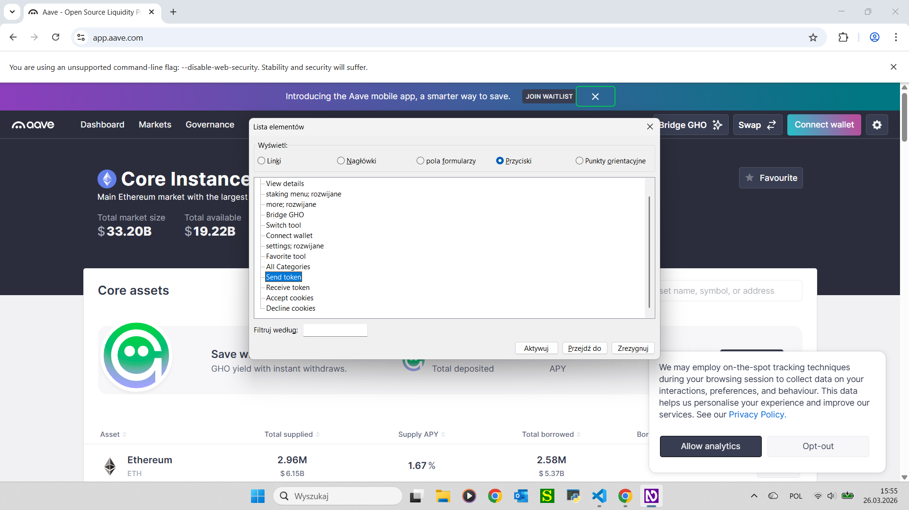

# Semantic Vision - AI Accessibility Layer for DeFi

> **Zero-Integration. Zero Protocol Changes. Full Accessibility.**

[]()
[](https://opensource.org/licenses/MIT)
[](https://python.org)
[](https://groq.com)
[](https://developer.chrome.com/docs/extensions/)
[](https://ec.europa.eu/social/main.jsp?catId=1202)

---

## The Manifesto

I lost my sight at fourteen.

At twenty-two, I opened a DeFi lending protocol for the first time. I heard this:

*"Niezidentyfikowany. Niezidentyfikowany. Niezidentyfikowany."*

Fourteen buttons. Fourteen times: Unidentified. No context. No way to know which one supplies ETH, which one borrows USDC, which one could empty my wallet if pressed by mistake.

**Decentralized finance promises permissionless access to capital for everyone.** That promise has an asterisk — and the asterisk says: *unless you are blind.*

I am blind. I refused to accept that asterisk. So I built the solution myself.

Semantic Vision is an AI layer that reads DeFi interfaces and generates meaningful ARIA labels in real time — on any protocol, without touching a single line of their code. It works today, on protocols that will never run an accessibility audit, for users who cannot wait.

This is not a charity project. This is infrastructure.

— *Vladyslav, Founder*

---

## The Problem

The DeFi ecosystem manages **over $100 billion in assets**. It is built on the principle of open, permissionless access.

Yet for **2.2 billion people** worldwide with visual impairments — including **43 million who are blind** — decentralized finance is a wall of silence.

| What a sighted user sees | What a blind user hears |
|--------------------------|------------------------|
| "Supply ETH" button | *"Niezidentyfikowany"* (Unidentified) |
| "Borrow USDC — 3.2% APY" button | *"Niezidentyfikowany"* |
| "Connect Wallet" button | *"Niezidentyfikowany"* |
| "Close modal" button | *"Niezidentyfikowany"* |
| 14 interactive controls on Aave | 14 × *"Niezidentyfikowany"* |

Existing solutions all require protocol developers to act:

- **Manual ARIA audits** cost $5,000–$50,000 per protocol and require dedicated developer time
- **Generic accessibility overlays** (AccessiBe, UserWay) do not understand DeFi semantics — "Supply", "Borrow", "APY", "TVL" are meaningless to a tool built for marketing websites
- **Screen reader compatibility modes** break Web3 wallet injection
- **Protocol developers** rarely prioritize accessibility — it is not their core product, and blind users have no leverage to change that

The result: blind users are systematically excluded from an entire financial paradigm. Not by malice. By indifference and inertia.

---

## The Solution

Semantic Vision is a **Zero-Integration AI Accessibility Overlay**.

It sits between the browser and the screen reader. It reads the DOM. It understands DeFi. It injects accurate ARIA labels in real time — without the protocol doing anything.

| | Without Semantic Vision | With Semantic Vision |
|--|------------------------|---------------------|
| **Setup required from protocol** | — | None |
| **Aave v3 buttons labeled** | 0 / 14 | **14 / 14** |
| **"Unidentified" announcements** | 14 | **0** |
| **Modal focus management** | Broken | Correct |
| **Dynamic elements (modals, dropdowns)** | Unlabeled | Labeled in real time |
| **Works offline (cached)** | — | ✅ 7-day cache |

### Why Zero-Integration changes everything

Every other accessibility solution requires someone on the protocol team to write code, run audits, and maintain compliance. That requires budget, priority, and time — none of which blind users control.

Semantic Vision requires nothing from protocols. It deploys client-side, runs locally on the user's machine, and works on any web interface. The same architecture that labels Aave's buttons today can label any site tomorrow — DeFi protocols, Web2 applications, e-commerce platforms. Adjusting the configuration and key bindings is sufficient to target a new domain entirely.

**This is not a DeFi-only product. It is a universal accessibility layer that starts with DeFi.**

---

## Visual Proof — Aave v3

> **Screenshot 1 — Before Semantic Vision**
>
> *Image description: NVDA screen reader speech log on app.aave.com showing entries reading "Niezaetykietowany" (Polish for "Unlabeled") for interactive buttons on the Aave lending interface. The user cannot determine which button is Staking menu, Send token, or Receive token. No accessible name exists on any interactive control.*


---

> **Screenshot 2 — After Semantic Vision**
>
> *Image description: NVDA screen reader speech log on the same app.aave.com page after Semantic Vision activation. Interactive elements now have meaningful labels: "Staking menu button", "Send token button", "Receive token button". The aria-live region has announced "elements labeled successfully."*



---

> **Live Demo**
>
> *Private Beta Demo available upon request for strategic partners and investors.*
>
> To schedule a live demonstration via video call:
> **[→ Contact via Twitter/X DM](https://x.com/VB_SemanticV)**
>
> *Demo overview: Screen recording showing NVDA navigating app.aave.com. First segment: without the extension — buttons announce "Niezidentyfikowany", navigation is impossible. After Semantic Vision activates: buttons are correctly labeled, the modal opens with proper focus management, and the aria-live region confirms successful labeling.*

---

## Architecture

Semantic Vision runs entirely on the user's machine. No wallet addresses, transaction data, or private keys ever leave the device. Only DOM structure and visual bounding boxes are sent to the AI inference endpoint.
```
┌─────────────────────────────────────────────────────────┐
│                 Chrome Extension (MV3)                  │
│                                                         │
│   content.js              background.js                 │
│   ┌───────────────┐       ┌─────────────────┐          │
│   │ DOM Collector │──────▶│ Native Messaging │          │
│   │ MutationObsvr │       │ Relay           │          │
│   │ ARIA Injector │◀──────│                 │          │
│   │ Focus Manager │       └────────┬────────┘          │
│   │ aria-live     │                │                    │
│   └───────────────┘                │                    │
└───────────────────────────────────│────────────────────┘
                                    │ Native Messaging
                                    ▼
                       ┌────────────────────────┐
                       │    native_host.py       │
                       │    Windows Registry     │
                       │    Bypasses Chrome PNA  │
                       └────────────┬───────────┘
                                    │ HTTPS (mkcert)
                                    ▼
                       ┌────────────────────────┐
                       │   server.py — FastAPI  │
                       │   localhost:8000        │
                       └──────────┬─────────────┘
                                  │
                    ┌─────────────┴─────────────┐
                    ▼                           ▼
        ┌──────────────────┐       ┌─────────────────────┐
        │ SpatialClusterer │       │    GroqClient        │
        │ grid=300px       │       │    LLaMA 3.3 70B     │
        │ max_dist=250px   │       │    + fallback chain  │
        └──────────────────┘       └─────────────────────┘
```

*Diagram description: Chrome Extension collects DOM elements and routes them via Native Messaging to a local FastAPI server. The spatial clustering algorithm groups nearby elements by proximity, providing richer context to the LLaMA 3.3 70B model via Groq API. Generated labels are injected back into the live DOM as aria-label attributes. The full chain runs locally on the user's machine.*

### Tech Stack

| Layer | Technology |
|-------|-----------|
| Extension | Chrome Manifest V3, Native Messaging API |
| Backend | Python 3.12, FastAPI, Pydantic v2 |
| AI Model | LLaMA 3.3 70B via Groq API |
| AI Fallback | OpenRouter, Gemini |
| DOM Parsing | Playwright |
| Clustering | Custom grid-based spatial proximity algorithm |
| SSL | mkcert (local certificate authority) |
| Cache | chrome.storage.local, 7-day TTL |
| Platform | Windows 10+, NVDA (JAWS: Stage 2 roadmap) |

---

## Tested Protocols

| Protocol | Elements Labeled | "Unidentified" After | Status |
|----------|-----------------|----------------------|--------|
| [Aave v3](https://app.aave.com) | 14 / 14 | 0 | ✅ Tested |
| [PancakeSwap](https://pancakeswap.finance) | Partial | — | 🔄 Early testing — Stage 2 |
| [Uniswap v3](https://app.uniswap.org) | — | — | 📋 Stage 2 |
| [Curve Finance](https://curve.fi) | — | — | 📋 Stage 2 |
| [Compound](https://app.compound.finance) | — | — | 📋 Stage 2 |
| Web2 / E-commerce | — | — | 📋 Stage 2 (configuration change only) |

---

## Access & Installation

Semantic Vision is currently in **private alpha**.

The core architecture is proven and working. Public deployment packaging — one-click installer, Docker container, automated SSL setup — is on the Stage 2 roadmap alongside the first funding round.

> **The current build is available for review and live demonstration to strategic partners and investors.**
> Easy-install scripts and full public documentation are planned for Stage 2.
>
> **[→ Request access or demo via Twitter/X DM](https://x.com/VB_SemanticV)**

---

## Roadmap

### Stage 1 — Foundation ✅ *Now*

- ✅ Working MVP: Chrome Extension + Native Messaging + FastAPI + Groq
- ✅ Aave v3: 14/14 buttons labeled, 0 "Unidentified"
- ✅ Real-time labeling via MutationObserver
- ✅ Modal focus management
- ✅ 7-day offline cache
- ✅ NVDA aria-live announcements
- 🔲 Uniswap v3 testing
- 🔲 One-click start launcher
- 🔲 First grant applications submitted

### Stage 2 — First Funding Round 🎯

- 🔲 Secure first grant or seed funding
- 🔲 Assemble core team: AI Engineer, Product Manager, Accessibility QA
- 🔲 10+ DeFi protocols covered
- 🔲 JAWS screen reader support
- 🔲 macOS + VoiceOver compatibility
- 🔲 Docker / easy-install public packaging
- 🔲 Chrome Web Store submission

### Stage 3 — European Market

- 🔲 B2B SDK for protocols wanting native accessibility compliance
- 🔲 Real-time accessibility audit dashboard
- 🔲 Firefox extension
- 🔲 Full alignment with EU Accessibility Act 2025
- 🔲 50+ protocols covered

### Stage 4 — Global Accessibility Infrastructure

- 🔲 US market entry
- 🔲 Support for global capital market interfaces
- 🔲 Multi-language ARIA label generation
- 🔲 Community label verification layer
- 🔲 Public API for third-party accessibility tooling

---

## Grant Applications & EU Compliance

The **EU Web Accessibility Act 2025** (European Accessibility Act, Directive 2019/882) mandates accessible digital financial services across all EU member states from June 2025. DeFi protocols operating in the EU face increasing regulatory pressure to meet these standards.

Semantic Vision is the only solution that achieves compliance without requiring protocol-side development work. This creates a direct alignment with the objectives of Polish and European innovation funding programs targeting digital inclusion and regulatory readiness.

| Program | Focus | Potential Amount | Status |
|---------|-------|-----------------|--------|
| **Aave Grants DAO** | Direct protocol accessibility | TBD | 🎯 Applying |
| **Gitcoin Grants** | DeFi public goods | Community-matched | 🎯 Applying |
| **EIC Accelerator** | European deep tech | Up to €2.5M | 🎯 Preparing |
| **NCBR / PARP** | Polish national R&D | TBD | 🎯 Preparing |
| **KPT Kraków Innovation Hub** | Regional incubation | TBD | 🤝 In talks |

---

## For Investors & Strategic Partners

> *"The DeFi accessibility gap is not a niche problem. It is infrastructure debt sitting beneath $100B+ in assets — and right now, it has no solution that works without protocol cooperation."*

Semantic Vision is the first AI-powered Zero-Integration accessibility layer built specifically for decentralized finance, created by a blind founder who is himself the primary user.

**What makes this defensible:**

- The founder is blind and built the MVP himself — unmatched understanding of the problem
- Zero-Integration architecture works on any web interface without protocol cooperation
- Regulatory tailwind: EU Accessibility Act 2025 creates compliance urgency across European markets
- Horizontal scalability: the same technology applies to any web application beyond DeFi

We are in private alpha and actively seeking our first strategic funding round to assemble the team and expand protocol coverage.

**[→ Start a conversation via Twitter/X DM](https://x.com/VB_SemanticV)**

---

## Security & Privacy

- No wallet addresses, transaction data, or private keys are ever processed or transmitted
- Only DOM structure and visual bounding boxes are sent to the AI model
- All processing runs locally on the user's machine
- Local HTTPS via mkcert — no external certificate authority required
- 7-day cache eliminates repeated API calls for known pages

---

## License

MIT License — see [LICENSE](LICENSE) for details.

---

## Acknowledgements

- [Groq](https://groq.com) — ultra-fast LLaMA inference that makes real-time labeling possible
- [NVDA Project](https://www.nvaccess.org) — the open-source screen reader that made this testable
- The blind and low-vision community in DeFi — for proving this problem is real, urgent, and unsolved

---

<div align="center">

**Semantic Vision**

*Because financial freedom shouldn't require perfect vision.*

[GitHub: @Wislaw](https://github.com/Wislaw/Semantic-Vision-Public) · [Twitter/X: DM open](https://x.com/VB_SemanticV)

</div>